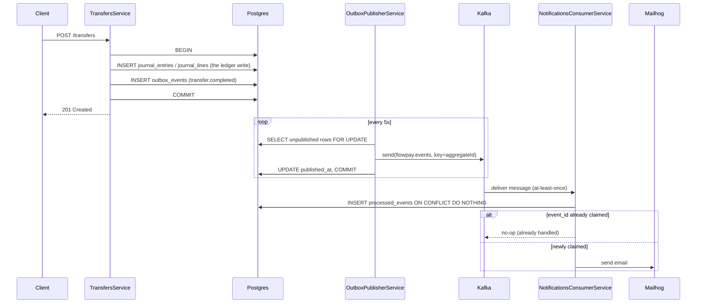

# FlowPay

FlowPay is a portfolio-grade **simulated** crypto & fiat payment and trading platform, modeled on
the architecture of regulated payment institutions. All money, transfers, and market activity are
simulated in Postgres — there is no real currency and no real blockchain involved. The backend is
a NestJS modular monolith (designed so modules can later be split into microservices); the
frontend is an Angular "Client Console" SPA that talks to it over `/api/v1`.

## Quickstart

Requirements: Docker and Docker Compose.

```bash
# bring up Postgres + Kafka + Mailhog + the API + the Angular dev server (all with hot reload)
docker compose up

# API is now available at:
curl http://localhost:3000/api/v1/health
# => { "status": "ok", "db": "up" }

# Client Console is now available at:
open http://localhost:4200

# Make a transfer (see "Transfers quickstart" below), then check the email it triggers:
open http://localhost:8025
```

## Backend development (without Docker)

```bash
cd backend
cp .env.example .env   # point DB_HOST etc. at your own Postgres instance
npm install
npm run migration:run  # applies any pending schema migrations
npm run seed            # idempotent: creates admin@flowpay.dev if missing
npm run start:dev
```

## Frontend development (without Docker)

```bash
cd frontend
npm install
npm start   # ng serve, proxying /api to http://localhost:3000 (see proxy.conf.js)
```

Requires the backend to be running separately (see above) — the dev server does not start it.
`BACKEND_URL` (default `http://localhost:3000`) controls where the dev-server proxy forwards `/api`
requests; docker-compose sets it to `http://backend:3000` since the backend isn't on localhost
inside the frontend's container.

| Command         | Description                                      |
| ---------------- | ------------------------------------------------- |
| `npm start`      | `ng serve` with the API proxy                     |
| `npm run lint`   | ESLint over the Angular app                       |
| `npm test`       | Unit tests (Vitest, runs headless in Node/jsdom — no Chrome needed) |
| `npm run build`  | Production build to `dist/frontend`               |

## Auth quickstart

```bash
# register a new user
curl -X POST http://localhost:3000/api/v1/auth/register \
  -H "Content-Type: application/json" \
  -d '{"email":"jane@example.com","password":"password123"}'
# => { "accessToken": "...", "user": { "id": "...", "email": "jane@example.com", "role": "user", ... } }

# log in
curl -X POST http://localhost:3000/api/v1/auth/login \
  -H "Content-Type: application/json" \
  -d '{"email":"jane@example.com","password":"password123"}'
# => { "accessToken": "...", "user": { ... } }

# fetch the current user profile
curl http://localhost:3000/api/v1/users/me \
  -H "Authorization: Bearer <accessToken>"
# => { "id": "...", "email": "jane@example.com", "role": "user", "createdAt": "...", "updatedAt": "..." }
```

Wrong password returns `401`, a duplicate email on register returns `409`, and hammering either
auth endpoint more than 5 times per minute from the same IP returns `429`.

## Ledger quickstart

`npm run seed` creates five currencies (USD, EUR, IDR, BTC, ETH) and their system accounts
(treasury/fees/withdrawal_pending, one set per currency). User wallets are created lazily the first
time they're touched.

```bash
# current user's balances across all currencies (wallets created on first access)
curl http://localhost:3000/api/v1/accounts -H "Authorization: Bearer <accessToken>"
# => [{ "currency": "USD", "balance": "0.00000000", "decimals": 2 }, { "currency": "BTC", ... }, ...]

# paginated journal history for one currency's wallet
curl "http://localhost:3000/api/v1/accounts/USD/transactions?page=1&limit=20" \
  -H "Authorization: Bearer <accessToken>"
# => { "data": [{ "type": "deposit", "direction": "credit", "amount": "...", "description": "...", "createdAt": "..." }], "meta": { "page": 1, "limit": 20, "total": 1 } }
```

### Design decisions

- **The journal is the source of truth.** `account_balances` is a cache maintained transactionally
  alongside every journal entry, purely for read performance — if it and the sum of
  `journal_lines` ever disagreed, the journal would win. The integration test suite asserts this
  invariant after every operation.
- **Every account uses one sign convention:** `balance = Σ(credit lines) − Σ(debit lines)`, with no
  per-account-kind flipping. A deposit is *credit user wallet / debit treasury*; a withdrawal
  settlement reverses it. This is what makes "treasury can go negative" fall out naturally, rather
  than needing a special case: since every entry balances to zero, and user wallets are bounded at
  zero from below, treasury/fees necessarily absorb the mirror image of what users hold.
- **Entries balance per currency, independently** — not just in aggregate — so a future
  multi-currency entry (e.g. an FX conversion posting both legs at once) can't sneak an imbalance in
  one currency past a balanced-looking total.
- **Deterministic lock ordering.** `postEntry` takes `SELECT ... FOR UPDATE` locks on the
  `account_balances` rows it will update, in one statement ordered by ascending account id. This is
  Postgres's own documented deadlock-avoidance pattern for transactions that lock overlapping sets
  of rows in different orders.
- **User accounts can't go negative; system accounts can.** Any account with a non-null
  `owner_user_id` is rejected (422) if a proposed entry would take it below zero. Accounts with a
  null `owner_user_id` (treasury, fees, withdrawal_pending) are exempt — they represent the
  platform's simulated counterparty position, not a real user's funds.
- **One write path.** All other modules call `LedgerService.postEntry()` / `ensureAccount()` —
  nothing else touches `journal_entries`, `journal_lines`, or `account_balances`. See CLAUDE.md.

## Deposits & withdrawals quickstart

Deposits are simulated and instant. Withdrawals follow a maker-checker (two-step approval) pattern
standard in regulated payment institutions: the user's request immediately **holds** the funds so
they can't be double-spent while pending, and a separate admin decision either **settles** (moves
the hold to treasury) or **releases** (returns the hold to the user's wallet) it.

```bash
# deposit (instant, capped by DEPOSIT_MAX_AMOUNT)
curl -X POST http://localhost:3000/api/v1/deposits \
  -H "Content-Type: application/json" -H "Authorization: Bearer <accessToken>" \
  -d '{"currency":"USD","amount":"200.00"}'
# => { "currency": "USD", "amount": "200.00", "balance": "200.00000000" }

# request a withdrawal -- funds are held immediately
curl -X POST http://localhost:3000/api/v1/withdrawals \
  -H "Content-Type: application/json" -H "Authorization: Bearer <accessToken>" \
  -d '{"currency":"USD","amount":"50.00","destination":"IBAN-SIMULATED-123"}'
# => { "id": "...", "status": "pending", "holdEntryId": "...", ... }

# own withdrawal history
curl http://localhost:3000/api/v1/withdrawals -H "Authorization: Bearer <accessToken>"

# admin: list pending requests
curl "http://localhost:3000/api/v1/admin/withdrawals?status=pending" \
  -H "Authorization: Bearer <adminAccessToken>"

# admin: approve (settles the hold to treasury) or reject (releases it back to the wallet)
curl -X POST http://localhost:3000/api/v1/admin/withdrawals/<id>/approve -H "Authorization: Bearer <adminAccessToken>"
curl -X POST http://localhost:3000/api/v1/admin/withdrawals/<id>/reject  -H "Authorization: Bearer <adminAccessToken>"
```

A deposit above `DEPOSIT_MAX_AMOUNT` returns `400`; a withdrawal request that would overdraft the
wallet returns `422`; a non-admin calling approve/reject returns `403`; deciding an
already-decided request returns `409` (the second admin's `SELECT ... FOR UPDATE` blocks until the
first's transaction commits, then re-reads the now-decided row and fails the pending-status check).

## Transfers quickstart

Instant transfers between users. `Idempotency-Key` is required on every request — this is the
flagship demonstration of safe-retry semantics in the API (see the design section below).

```bash
# transfer funds -- the Idempotency-Key header is required
curl -X POST http://localhost:3000/api/v1/transfers \
  -H "Content-Type: application/json" -H "Authorization: Bearer <accessToken>" \
  -H "Idempotency-Key: $(uuidgen)" \
  -d '{"recipientEmail":"jane@example.com","currency":"USD","amount":"25.00","note":"lunch"}'
# => { "entryId": "...", "currency": "USD", "amount": "25.00", "balance": "175.00000000" }
# (never the recipient's balance -- see below)

# own transfer history, sent and received
curl http://localhost:3000/api/v1/transfers -H "Authorization: Bearer <accessToken>"
```

Retrying the **exact same request** with the **same key** (e.g. because the client didn't see the
first response) is safe: it returns the identical cached response and never posts a second ledger
entry. Reusing the same key with a **different** payload is rejected (`422`) rather than silently
executing the new request.

### Payments: idempotency & concurrency

- **`Idempotency-Key` is required** on `POST /transfers` (`400` if missing). The key is scoped to
  `(user_id, key)` — two different users may reuse the same literal key string without conflict.
- **How a key is claimed.** `IdempotencyService.run()` first does an immediately-committed
  `INSERT INTO idempotency_keys ... ON CONFLICT (user_id, key) DO NOTHING` — a real mutual-exclusion
  lock, deliberately committed *before* the transfer's own transaction starts (not as part of it).
  Whichever request wins the insert runs the handler; every other concurrent request with the same
  key sees the row and either gets `409` (still `processing`) or the cached `{statusCode, body}`
  once it's `completed`.
  - This module is written as reusable infrastructure (`common/idempotency/`), not something
    transfer-specific — `POST /fx/convert` calls the same `IdempotencyService.run()` (see "FX
    conversion quickstart" below).
- **What gets cached.** Every *completed* outcome is cached and replayed byte-identical on a
  retry — including a deterministic rejection like insufficient funds (`422`) or an unknown
  recipient (`404`). This matches how idempotency keys behave in the systems it's modeled on
  (Stripe, etc.): the key represents one attempt at *this exact operation*, so if it failed for a
  reason tied to the payload, retrying with the same key replays the same failure — the client
  must use a new key to genuinely try again (e.g. after depositing more funds). An *unexpected*
  (non-`HttpException`) error is **not** cached: the key is deleted instead, so a real retry can
  actually re-attempt the operation rather than being poisoned by an infrastructure blip.
- **Known trade-off, stated plainly.** Marking a key `processing` and later marking it `completed`
  are two separate commits, on purpose — that's what lets a concurrent duplicate get a fast `409`
  instead of blocking for the full duration of the transfer's own transaction. The cost: a crash
  between those two commits leaves the row stuck at `processing` forever, with no automatic
  recovery. Mitigation, not elimination: `IDEMPOTENCY_STALE_MS` (default 30s) — a `processing` row
  older than that is treated as abandoned and reclaimed on the next attempt with that key, instead
  of returning `409` indefinitely. A proper fix (an outbox/saga that guarantees the ledger commit
  and the key's completion move together) is out of scope here.
- **The ledger entry itself** is a normal `LedgerService.postEntry()` — debit sender wallet, credit
  recipient wallet, and (only when `TRANSFER_FEE_FLAT` is nonzero) a third line crediting
  `fees[currency]`. The fee is additive: the sender is debited `amount + fee`, the recipient always
  receives exactly `amount`. This composes with everything in the ledger's own design section
  above — same sign convention, same per-currency balancing, same overdraft guard.
- **Concurrency is tested at the HTTP layer**, not just the ledger: `N` parallel requests with the
  *same* idempotency key produce exactly one journal entry; `N` parallel *distinct* transfers that
  jointly exceed a wallet's balance let exactly the affordable subset through, and the balance
  never goes negative.

## FX conversion quickstart

Simulated currency conversion (fiat ↔ crypto, fiat ↔ fiat, crypto ↔ crypto) at live rates, with the
same `Idempotency-Key` guarantees as transfers.

```bash
# current rate matrix -- public market data, no auth required
curl http://localhost:3000/api/v1/fx/rates
# => { "base":"USD","asOf":"...","source":"coingecko","prices":{"USD":"1","BTC":"65000",...},"matrix":{...} }

# a live quote -- no auth, no persistence; valid for the current rate-cache window
curl "http://localhost:3000/api/v1/fx/quote?from=USD&to=BTC&amount=100"
# => {"from":"USD","to":"BTC","amount":"100.00","rate":"...","spreadBps":50,"netRate":"...","toAmount":"...","quoteExpiresAt":"..."}

# execute the conversion -- Idempotency-Key required, exactly like transfers
curl -X POST http://localhost:3000/api/v1/fx/convert \
  -H "Content-Type: application/json" -H "Authorization: Bearer <accessToken>" \
  -H "Idempotency-Key: $(uuidgen)" \
  -d '{"from":"USD","to":"BTC","amount":"100.00"}'
# => {"entryId":"...","from":"USD","to":"BTC","amount":"100.00","toAmount":"...","rate":"...",
#     "netRate":"...","spreadBps":50,"fromBalance":"...","toBalance":"..."}
```

### Design decisions

- **Rate source & resilience.** `RateProvider` is a small strategy interface with two
  implementations: `CoinGeckoRateProvider` (the public `simple/price` endpoint, no API key) and
  `StaticRateProvider` (a hardcoded fallback snapshot). `RatesService` caches USD-anchored prices
  for `RATE_CACHE_TTL_MS` (default 30s); on cache expiry it tries the live provider first and, on
  **any** failure (network, timeout, malformed response), falls back to the static provider and
  logs a warning instead of failing the request. This is deliberate: the app must keep working with
  no network access at all, at the cost of (clearly labeled, via the response `source` field) stale
  rates.
- **USD is the anchor currency; fiat cross-rates are bridged through BTC.** CoinGecko prices actual
  coins against a `vs_currency`, not fiat-to-fiat pairs, so there's no direct EUR/USD or IDR/USD
  rate to request. One call (`ids=bitcoin,ethereum&vs_currencies=usd,eur,idr`) is enough:
  `usdPrice(BTC)` and `usdPrice(ETH)` come directly from the `usd` field, and
  `usdPrice(EUR) = usdPrice(BTC) / (BTC priced in EUR)` — standard triangulation through a common
  asset. Any pair's rate is then just `usdPrice(from) / usdPrice(to)`. This is hardcoded to the
  app's fixed 5-currency universe rather than built as an N-currency generic client, since there's
  no other currency in the system to generalize for.
- **Spread**: `FX_SPREAD_BPS` (default 50 = 0.5%) is applied once, as `netRate = rawRate * (1 -
  spreadBps / 10000)`. `GET /fx/quote` and `POST /fx/convert` share one internal calculation method
  so a quote is guaranteed to match what convert actually does (modulo rate drift if the cache
  refreshes between the two calls).
- **Rounding: half-even (banker's rounding), to the target currency's own `decimals`.** Chosen
  because it doesn't systematically bias amounts up or down across many conversions the way
  round-half-up would — appropriate for a platform computing its own margin off the same rounding.
  Applied via `decimal.js`'s `Decimal.ROUND_HALF_EVEN` everywhere an amount is truncated to a
  currency's native precision (both the `from` amount and the computed `to` amount).
- **Ledger posting: the spread stays implicit in the treasury's position, not a separate fee
  line.** `POST /fx/convert` posts one atomic 4-line `fx_convert` entry: debit user[from] / credit
  treasury[from] at the user's original amount, then debit treasury[to] / credit user[to] at the
  **net** (spread-reduced) amount. Each currency balances independently, as required by the
  ledger's own per-currency invariant. Averaged over many conversions in both directions, the
  treasury structurally receives slightly more value than it gives up — that gap **is** the
  platform's margin, with no separate `fees` account entry needed. (An explicit `fees[from]` line
  was considered and is equally valid against the ledger's invariants; implicit was chosen only for
  simplicity.)
- **`/fx/convert` reuses `IdempotencyService` unchanged** — no refactor was needed, since it was
  already generic (`userId`/`key`/`endpoint`/`requestPayload`/`successStatus`/`handler`) and was
  designed for exactly this reuse (see "Payments: idempotency & concurrency" above).
- **`GET /fx/rates` and `GET /fx/quote` don't require authentication** — they're public market data
  with no user-specific information, matching how a real exchange exposes rates/quotes publicly
  while gating the actual trade behind auth.

## Trading quickstart

Simulated spot trading (market and limit orders) on top of the FX rates. **No real matching
engine**: every order — a market order, or a limit order once triggered — executes against the
platform (treasury), never against another user's order.

```bash
# market order -- executes immediately at the current rate (no spread, unlike FX conversion)
curl -X POST http://localhost:3000/api/v1/orders \
  -H "Content-Type: application/json" -H "Authorization: Bearer <accessToken>" \
  -d '{"pair":"BTC/USD","side":"buy","type":"market","quantity":"0.01"}'
# => {"id":"...","pair":"BTC/USD","side":"buy","type":"market","quantity":"0.01000000",
#     "limitPrice":null,"status":"filled","holdEntryId":null,"fillEntryId":"...",
#     "filledPrice":"...","filledAt":"...","createdAt":"..."}

# limit order -- holds funds immediately, fills later if the price crosses (checked every ~10s)
curl -X POST http://localhost:3000/api/v1/orders \
  -H "Content-Type: application/json" -H "Authorization: Bearer <accessToken>" \
  -d '{"pair":"BTC/USD","side":"buy","type":"limit","quantity":"0.01","limitPrice":"50000.00"}'
# => {"id":"...","status":"open","holdEntryId":"...","limitPrice":"50000.00",...}

# cancel an open order -- releases the hold back to the wallet
curl -X DELETE http://localhost:3000/api/v1/orders/<id> -H "Authorization: Bearer <accessToken>"

# own orders, optionally filtered by status
curl "http://localhost:3000/api/v1/orders?status=open" -H "Authorization: Bearer <accessToken>"
```

### Design decisions

- **No real matching engine, stated up front.** FlowPay simulates a venue where the platform is
  always the counterparty, not a peer-to-peer order book — the same simplification the whole app is
  built on (no real currency, no real blockchain).
- **Market orders execute at the raw rate, with no spread** — unlike FX conversion's
  `FX_SPREAD_BPS`. Trading and FX conversion are treated as separate pricing surfaces; keeping
  trading spread-free keeps its math (and its tests) simple, with no requirement to charge one.
- **Shared execution logic via `TradeExecutionService`** (`common/trade-execution/`, extracted from
  FX conversion rather than duplicated): the one place that knows how to post an atomic 2-currency
  ledger swap (debit source / credit treasury[from], debit treasury[to] / credit destination
  wallet). FX conversion and every trade fill call the *same* method — the only thing that varies
  per caller is the *source* account: a user's own wallet for FX and market orders, or the pooled
  `trade_hold[currency]` account for a filled limit order.
- **Limit-order holds are sized so the hold and the eventual fill are always byte-identical.** A buy
  limit holds `quantity × limitPrice` of the *quote* currency (the worst-case cost); a sell limit
  holds `quantity` of the *base* currency (fixed, price-independent). Crucially, **a triggered limit
  order fills at its own limit price, not the prevailing market rate** — so the amount consumed from
  the hold is always exactly what was reserved, with no partial-release reconciliation step needed.
- **The hold/fill/release ledger flow mirrors withdrawals' hold/settle/release**, with
  `trade_hold[currency]` (a new pooled system account, seeded per currency like `treasury`) playing
  the role `withdrawal_pending[currency]` plays there: **hold** (`TRADE_HOLD` entry: debit
  user/credit `trade_hold`) on limit placement, **fill** (`TRADE` entry, via
  `TradeExecutionService`) on a crossed limit or an immediate market order, **release**
  (`TRADE_RELEASE` entry: debit `trade_hold`/credit user — the exact inverse of the hold) on cancel.
- **Cancel-vs-fill race, guarded by the same row-lock pattern as withdrawals' maker-checker guard.**
  `OrdersService.cancelOrder()` and `OrdersWorkerService.tryFill()` both lock the order row with
  `SELECT ... FOR UPDATE` and re-check `status === 'open'` before acting. Whichever transaction's
  lock wins commits its outcome; the other sees the already-updated status once it acquires the lock
  and safely no-ops (a fill returns `false`; a cancel throws `409`) — a hold is released **exactly
  once**, never both, never neither. Verified under real concurrent transactions (not mocks) in
  `test/orders-race.integration-spec.ts`, run 20 times in a loop to shake out timing-dependent bugs.
- **The worker (`OrdersWorkerService`) is a `@nestjs/schedule` `@Cron` job, ticking every ~10s**,
  scanning all `status = 'open' AND type = 'limit'` orders and calling the same `tryFill()` exercised
  by the race tests above. It logs and continues past any single order's failure rather than letting
  one bad row stop the whole scan.
- **No trading-pairs table.** `pair` is a free-form `"BASE/QUOTE"` string, split and validated
  against the `currencies` table per request (base and quote must both exist and differ) —
  consistent with FX's "any two distinct currencies" flexibility. The frontend's Trade page narrows
  this to a curated dropdown (crypto base against a fiat quote) purely for a sane default UI, not
  because the backend enforces it.

## Event-driven architecture: the transactional outbox

Every state-changing feature (deposits, transfers, withdrawal approval/rejection, FX conversion,
order fills) publishes a domain event — `deposit.completed`, `transfer.completed`,
`withdrawal.approved`, `withdrawal.rejected`, `fx.converted`, `order.filled` — to Kafka, consumed
by a `notifications` module that emails the affected user via a dev-only SMTP catcher (Mailhog).
This exists to demonstrate the thing CLAUDE.md's "Architecture" section states as a design goal:
that this modular monolith's boundaries are real enough to extract a module into its own service
without a rewrite. `notifications` proves it concretely — it depends on nothing but Kafka, its own
`processed_events` table, and SMTP; not one import of `LedgerModule`, `UsersModule`, or any other
domain module.

The mechanism connecting the two sides is the **transactional outbox pattern**:



**Why not just publish to Kafka right after the ledger write commits?** Because "commit, then
publish" straddles a gap no amount of careful code closes: a crash (or a Kafka broker that happens
to be unreachable) between those two steps either loses the event entirely (the commit succeeded
but the publish never happened) or, if you reorder it to "publish, then commit," can publish an
event for a transaction that then rolls back — a **phantom event** describing something that never
actually happened. The outbox sidesteps both failure modes by writing the event to
`outbox_events` **in the same database transaction** as the ledger write itself
(`OutboxService.append(event, manager)` takes its `EntityManager` as a required argument, not an
optional one, specifically so this can't be gotten wrong): if the transaction commits, the event
row exists, guaranteed; if it rolls back, the event row never existed, guaranteed. A separate
`OutboxPublisherService` — a `@nestjs/schedule` cron job, mirroring `OrdersWorkerService`'s
established pattern in this codebase — polls `outbox_events WHERE published_at IS NULL` every 5
seconds and publishes each row to Kafka, in its own per-row transaction (lock row, send, mark
published, commit). This yields **at-least-once delivery**: a crash between Kafka acking the send
and the row's `published_at` being committed means the row gets published again on the next tick —
never lost, occasionally duplicated.

Because delivery is at-least-once, **the consumer must be idempotent**, not merely "usually
correct." `NotificationsConsumerService` claims each event id via
`INSERT INTO processed_events (event_id) VALUES ($1) ON CONFLICT (event_id) DO NOTHING RETURNING
event_id` before doing anything else — the exact same atomic-claim idiom
`IdempotencyService`'s `idempotency_keys` table already uses for the same reason (see "Payments:
idempotency & concurrency"). A losing claim (row already existed) means "already handled, skip";
a winning claim means "mine, send the email." Delivering the same Kafka message twice this way
still sends exactly one email.

### Design decisions

- **Interfaces + fakes over Testcontainers Kafka.** `EventProducer`/`EventConsumer`
  (`common/kafka/interfaces/`) are plain TypeScript interfaces with `kafkajs`-backed
  implementations behind DI tokens (`EVENT_PRODUCER`/`EVENT_CONSUMER`, since interfaces erase at
  runtime). Everything this feature needs to prove — atomicity of the outbox write, at-least-once
  publishing, idempotent consumption — is fully testable against an in-memory fake producer or
  consumer; none of it depends on a real broker's specific wire behavior. This follows the same
  precedent `RateProvider` already set for `RatesService`: reserve Testcontainers for semantics
  that genuinely can't be faked (Postgres's actual transaction/locking behavior, in
  `outbox-atomicity.integration-spec.ts` and `orders-race.integration-spec.ts`), and use fakes for
  everything else. Adding a second heavyweight Testcontainers dependency just to prove "Kafka
  redelivers messages" — a documented, assumed property, not something to verify — wasn't worth it.
- **KRaft-mode Kafka, no Zookeeper** (`apache/kafka:3.9.0`), with the same dual-listener setup
  Postgres already uses in `docker-compose.yml`: `kafka:29092` for other containers,
  `localhost:9092` for a backend running natively during `npm run start:dev`.
- **Kafka connectivity is resilient by design, not just by accident.** `KafkaEventProducer` and
  `NotificationsConsumerService` both connect/subscribe in a fire-and-forget retry loop with
  backoff (capped at 30s) instead of `await`ing the connection inside `onModuleInit()` — Kafka
  being temporarily unreachable at boot must never crash the rest of the app, since notifications
  are inherently best-effort. `KafkaEventConsumer` additionally listens for kafkajs's own `CRASH`
  event and resubscribes from scratch, because disabling kafkajs's *internal* connection retry
  (`retry: { retries: 0 }` — necessary so a genuinely dead broker fails fast instead of leaving
  sockets and timers open past this app's own shutdown) has the side effect of disabling kafkajs's
  default crash-auto-restart too. All three retry loops cancel their pending timers in
  `onModuleDestroy()` so a stopped app doesn't keep retrying in the background.
- **`notifications`'s module boundary is deliberately narrow.** It imports `KafkaModule` and its
  own `TypeOrmModule.forFeature([ProcessedEvent])` — nothing else. Every value a rendered email
  needs (`recipientEmail`, amounts, currencies) is embedded in the event payload at the point the
  domain service appends it to the outbox, since that's where a `UsersService` lookup is actually
  available; the consumer never looks anything up itself. This is what makes the "could this become
  its own microservice tomorrow" claim concrete rather than aspirational.
- **Plain-text email templates, no templating engine.** `notifications/templates/` is one pure
  function (`renderEmail(eventType, payload)`) with a `switch`, matching this app's general bias
  toward the simplest thing that works over pulling in a dependency for six short strings.

## Client Console (frontend)

An Angular 22 standalone-components SPA (`frontend/`), Angular Material for the UI, signals for
local component state. It talks to the backend exclusively through `/api/v1` — the backend doesn't
enable CORS, so the dev server proxies `/api` to it (see `frontend/proxy.conf.js`) rather than
calling it cross-origin.

**Pages**: login/register, a dashboard with one balance card per currency and quick actions
(deposit, transfer, withdraw, convert, trade), a transactions table (server-side paginated,
filterable by currency), withdrawals (request + own history with status chips), transfers (send +
history, sent/received), convert (live quote refreshed automatically, confirm dialog showing the
rate and spread before submitting), trade (live price, market/limit buy/sell, open orders with
cancel, order history), and an admin area (pending withdrawals with approve/reject, visible only
when the JWT's role is `admin`).

### Manual walkthrough / capturing screenshots

There's no automated visual regression suite — to see it end to end (and capture screenshots for
this README), run `docker compose up` (or the two dev servers separately) and, against
`http://localhost:4200`:

1. Register two users (e.g. `jane@example.com`, `bob@example.com`).
2. As Jane: **Deposit** some USD from the dashboard quick action.
3. As Jane: **Transfer** part of it to `bob@example.com` from the Transfer page — note the
   `Idempotency-Key` request header in your browser's network tab; it's a fresh UUID per attempt,
   reused only if you force a network error (e.g. throttle to "Offline" mid-request in devtools)
   and hit the resulting **Retry** button.
4. As Jane: request a **withdrawal** from the Withdrawals page.
5. As Jane: **Convert** some USD to BTC from the Convert page — watch the quote update live as you
   change the amount, confirm the dialog shows the rate and spread, and check the dashboard balance
   updates for both currencies afterward.
6. As Jane: place a **market buy** on the Trade page — it fills instantly, moving both balances.
   Then place a **limit buy** far below the live price — it appears under "Open orders" with funds
   held, and **Cancel** it to see the hold released back to the wallet.
7. Log in as `admin@flowpay.dev` (password from `SEED_ADMIN_PASSWORD`, default `ChangeMe123!`) —
   note the "Admin" nav link only appears for this account — and **approve** or **reject** the
   pending request from Admin → Withdrawals.
8. Back as Jane, confirm the balance and the Transactions page reflect every step.

### Known simplifications (frontend)

- **JWT + profile in `localStorage`**, not an httpOnly cookie. This is the standard trade-off for a
  demo SPA: simpler (no CSRF token dance, no same-site cookie/proxy configuration to get right
  across dev and prod origins), but a JS-executed XSS on this app *could* read the token, which a
  cookie marked httpOnly would prevent. Acceptable here because the 15-minute `JWT_EXPIRES_IN`
  (no refresh token — see below) already caps the blast radius; a production version of this app
  should move to an httpOnly, same-site cookie issued by the backend instead.
- **The admin withdrawals table can't show *who* requested a withdrawal** — only the destination,
  amount, and currency. `WithdrawalResponseDto` doesn't expose the requesting user's id or email
  (by design, to keep that endpoint from leaking user data to a party who didn't ask for it beyond
  what's needed to decide), so the admin review screen is judged on destination + amount alone.
  Surfacing the requester would need a backend DTO change, out of scope for a frontend-only task.
- **The Trade page's pair dropdown is a curated, hardcoded list** (each crypto currency against
  each fiat currency) rather than every combinatorial pair the backend would technically accept —
  a deliberate, sane default for the UI, not a backend restriction (see "Trading quickstart").

## Known simplifications

- **No refresh tokens.** Access tokens are short-lived (15 minutes, `JWT_EXPIRES_IN`) and there is
  no refresh-token flow — once a token expires, the client must log in again. This is intentionally
  out of scope for now.
- **The ledger integration suite (`npm run test:integration`) requires a local Docker daemon** — it
  spins up a real, disposable Postgres via Testcontainers. It is not wired into `.gitlab-ci.yml`
  because the current CI runner image (`node:20`) has no Docker socket available; running it in CI
  would need a Docker-in-Docker-enabled runner.
- **`withdrawal_requests.settle_entry_id` is reused for both outcomes**: it holds the settle entry
  id on approval and the release entry id on rejection (there is no separate `release_entry_id`
  column), matching the originally specified schema.
- **An idempotency key can get stuck `processing`** if the process crashes between committing the
  underlying operation and marking the key `completed` (see "Payments: idempotency & concurrency"
  above). `IDEMPOTENCY_STALE_MS` reclaims it on the next attempt rather than blocking forever, but
  this is a mitigation, not a full fix — a proper fix needs an outbox/saga pattern, out of scope here.
- **The limit-order matching worker isn't distributed-safe, only correctness-safe.** Running
  multiple backend instances means each instance's own `@Cron` job independently scans and attempts
  every open limit order — the row-lock guard (see "Trading quickstart") ensures a given order is
  still only ever filled once, but the redundant scanning/locking work doesn't shard across
  instances. Fine at this app's scale; a production version would want a single leader (or a
  queue-based dispatch) doing the scanning instead.
- **`.gitlab-ci.yml`'s `test` stage provisions Postgres but not Kafka/Mailhog.** e2e tests boot the
  full `AppModule`, which now includes Kafka producer/consumer connections — this works today only
  because of the retry-with-backoff + `onModuleDestroy()` cleanup described in "Event-driven
  architecture" above (a genuinely unreachable broker fails fast and retries in the background
  rather than blocking or crashing app bootstrap). A more complete CI setup would add `kafka` as a
  CI service alongside `postgres` so the outbox is exercised end-to-end in the pipeline too, not
  just locally via `docker compose up`.

Useful scripts (run from `backend/`):

| Command                    | Description                                   |
| --------------------------- | ---------------------------------------------- |
| `npm run start:dev`         | Start the API with hot reload                  |
| `npm run lint`               | ESLint over `src` and `test`                   |
| `npm run test`               | Unit tests (Jest)                              |
| `npm run test:e2e`           | End-to-end tests against a real Postgres       |
| `npm run test:integration`   | Ledger integration tests (Testcontainers, needs Docker) |
| `npm run migration:generate` | Generate a migration from entity changes       |
| `npm run migration:run`      | Apply pending migrations                       |
| `npm run migration:revert`   | Revert the last applied migration              |
| `npm run seed`                | Idempotently seed the dev admin user + ledger  |

See [CLAUDE.md](CLAUDE.md) for architecture and the hard conventions this project follows.
